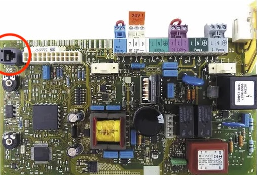

# esphome-vaillant-x6  

ESPHome component for Vaillant heating boilers with the X6 interface.  


## Overview  

This ESPHome component allows you to read various operational parameters from Vaillant heating boilers equipped with the **X6 interface**. The component communicates with the boiler via UART and can be integrated into Home Assistant.  


## Features  

Continuously reads the following sensor values from the boiler and sends them to Home Assistant:

| Sensor                               | Interval |
|--------------------------------------|----------|
| **Actual Flow Temperature**          | 10s      |
| **Target Flow Temperature**          | 60s      |
| **Return Flow Temperature**          | 10s      |
| **Burner Status (On/Off)**           | 10s      |
| **Circulating Pump Status (On/Off)** | 10s      |


## Installation  

Add the `vaillant_x6` and a `uart` component to your ESPHome configuration.

```yaml
esphome:
  name: vaillant_x6
  platform: ESP32
  board: esp32dev

external_components:
  - source: github://ulich/esphome-vaillant-x6
    components: [ vaillant_x6 ]

uart:
  id: my_uart
  tx_pin: GPIO06
  rx_pin: GPIO07
  baud_rate: 9600

vaillant_x6:
  uart_id: my_uart
```

You can also choose other GPIO pins for TX and RX on the ESP.


## Configuration

Only the `uart_id` must be configured. There are no more configuration properties as of now. 


## Vaillant X6 Interface  

The **X6 interface** is a service port found on some older Vaillant boilers (for example on Vaillant ecoTEC classic VC 196/2 - C). It provides a simple 5V-UART communication interface for retrieving operational data.

  


### Connection  

To safely connect an ESP device to the boiler's X6 interface, a **galvanic isolation** is recommended to avoid electrical damage to both the ESP but more importantly to the circuit board of the boiler. This can be achieved using optocouplers. Also note, that the ESP uses 3,3V and the X6 interface operates on 5V. **Connecting the ESP directly to the X6 interface will damage your ESP immediately!**


### Wiring Example  

```
                               +-----------+        +--------+
                               |Optocoupler|        |Inverter|
                               |           |        |        |
                    +----------|VCC     IN |--------|OUT   IN|-----+
                    |      +---|OUT        |        |        |     |
+-----------+       |  +---+---|GND    GND |---+    |     GND|-----+--------+
|      3,3V |-------+  |   |   |           |   |    |     VCC|-----+----+   |      +---------+
|           |       |  |   |   +-----------+   |    +--------+     |    |   |      --- 24V   |
|        RX |--------------+                   +-------------------|----|---+----- --- GND   +--+
|        TX |--------------+                                       +----|---|----- --- TX       |
|           |       |  |   |                                       +----|---|----- --- RX       |
|       GND |-------|--+   |    +--------+        +-----------+    |    +---|----- --- 5V    +--+
+-----------+       |  |   |    |Inverter|        |Optocoupler|    |    |   |      ---       |
     ESP            |  |   |    |        |        |           |    |    |   |      +---------+
                    |  |   +----|IN   OUT|--------|IN     VCC |----|----+   |           X6
                    |  |        |        |        |           |    |        |      When looking onto
                    |  +--------|GND     |    +---|GND    OUT |----+        |     the port from above
                    +--|--------|VCC     |    |   |       GND |-------------+
                       |        +--------+    |   +-----------+
                       |                      |
                       +----------------------+
```

For example, 2x 6N139 as optocoupler and 2x 2N7000 as inverter can be used. Note that resistors were not included in this schematic.


## Acknowledgments

Many insights for this project were taken from https://old.ethersex.de/index.php/Vaillant_X6_Schnittstelle. Without this valuable information, this project would not have been possible. A big thank you to the contributors of that documentation! 🙌
